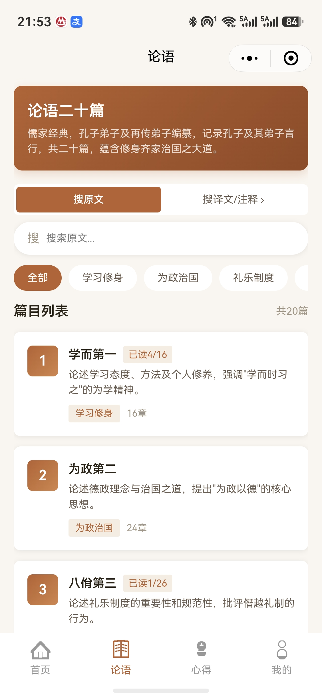
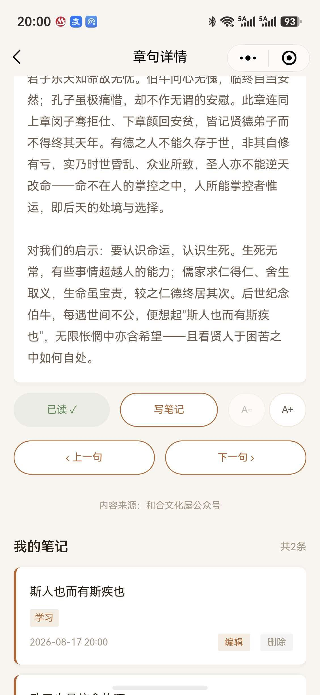

<div align="center">

# 论语学习

> 学而时习之，不亦说乎

**《论语》二十篇 · 509 章句精读 · 中英双语 · 微信小程序 / Windows / 安卓三端同源**

[](#) [](./LICENSE) [](https://github.com/ma3hao2/Lunyu-Learning/releases/latest)

</div>

<p align="center">
  
  &nbsp;
  
  &nbsp;
  
</p>

---

## 📦 下载安装（全部免费）

| 平台 | 下载 | 说明 |
|---|---|---|
| **Windows** | [安装版 Setup](https://github.com/ma3hao2/Lunyu-Learning/releases/download/v1.1.0/LunYu-Setup-1.1.0-x64.exe) ｜ [免安装 Portable](https://github.com/ma3hao2/Lunyu-Learning/releases/download/v1.1.0/LunYu-Portable-1.1.0-x64.exe) | 64 位，解压即用或双击安装 |
| **安卓** | [APK 安装包](https://github.com/ma3hao2/Lunyu-Learning/releases/download/v1.1.0/LunYu-v1.1.0-android.apk) | 需允许「安装未知来源应用」 |
| **微信小程序** | 微信内搜索「论语学习」 | 无需安装，登录后进度云端互通 |

更多历史版本见 [Releases 页面](https://github.com/ma3hao2/Lunyu-Learning/releases)。

## ✨ 功能特性

**内容精读**
- 《论语》二十篇全量 509 条章句：原文、白话译文、注释解读、核心要点
- 每日推荐：按篇章主题 20 天一轮，同一天全用户看到同一句，跨年不重复
- 双入口全库搜索：搜原文，或搜译文 / 注释

**中英双语**
- 设置页 / 首页一键切换中文 / English，章句译文与全部界面文案随语言切换
- 英文缺失时逐字段回退中文，文言原文保持不译；英文数据与 [lunyu-web](../lunyu-web) 共用同一翻译产线

**学习体验**
- 已读标记、连续学习天数、阅读进度条；登录后自动合并匿名期数据并云端同步
- 本地笔记：随手记录学习感悟，支持编辑 / 删除 / 标签，随进度云同步（个人笔记，无公开社区）
- 隐私合规：接入微信隐私保护框架，授权前不上传任何数据

**工程质量**
- Jest 21 套件 / 257 项单元测试全绿（存储合并、云函数、解压器、双语搜索、i18n、每日推荐）

## 🏗️ 三端一码

一套代码，三种形态：

| 端 | 壳 | 构建 |
|---|---|---|
| 微信小程序 | 微信运行时 | `npm run build:weapp` → `dist/` |
| Windows | Electron（[`desktop/`](./desktop)）托管 H5 产物 | `npm run build:h5` → `dist-h5/` → `cd desktop && npm run dist` |
| 安卓 APK | Capacitor 7（[`../lunyu-android/`](../lunyu-android)）托管 H5 产物 | `npm run build:h5` → `dist-h5/` 拷入 www → `cap sync` → `gradlew assembleRelease` |

> [!NOTE]
> Taro 构建会清空输出目录，因此 weapp 与 h5 输出按端分离（`dist/` 与 `dist-h5/`），互不覆盖。微信开发者工具预览前只需保证跑过 `build:weapp`。

## 🧰 技术栈

| 层 | 技术 |
|---|---|
| 框架 | Taro 4.1.x + React 18 + TypeScript |
| 平台 | 微信小程序（主）+ H5（Electron / Capacitor 套壳） |
| 后端 | 微信云开发：云函数 `login` / `syncProgress` + 云数据库、云存储 |
| 数据 | 章句数据构建时 deflate 压缩，运行时纯 JS 解压（无 pako 依赖） |
| i18n | `src/i18n/`：zh/en 并排字典 + React Context，tabBar / 导航栏动态刷新 |
| 测试 | Jest + ts-jest（21 套件 / 257 用例） |

## 📂 目录结构

```
├── src/
│   ├── app.tsx / app.config.ts      # 入口、I18nProvider、隐私门禁、分包/预下载配置
│   ├── i18n/                        # zh/en 字典 + I18nProvider / t()
│   ├── pages/                       # 主包页面：首页 / 论语 / 笔记 / 我的 / 设置 / 隐私
│   ├── packageContent/              # 分包页面：篇章详情 / 章句详情 / 写笔记 / 译文搜索
│   ├── data/                        # 章句数据（中文压缩 blob + 英文压缩 blob + loader）
│   ├── services/                    # auth（登录 / 云同步 / 隐私授权）、search、sync
│   ├── utils/                       # storage（进度 / 合并）、settings、inflate（解压）
│   └── config/cloud.ts              # 云环境 ID（本地覆盖见「部署」）
├── cloudfunctions/                  # 云函数：login / syncProgress
├── scripts/                         # 数据生成与辅助脚本
├── tests/                           # Jest 测试
├── desktop/                         # Windows 桌面版（Electron 壳）
└── docs/                            # 文档：改造计划、审查报告、截图
```

## 🚀 本地开发

```bash
npm install
npm test                 # 257 项测试
npm run dev:weapp        # 小程序开发模式（watch）
npm run build:weapp      # 构建小程序（输出 dist/）
npm run build:h5         # 构建 H5（Windows / APK 壳共用产物）
```

用微信开发者工具导入**项目根目录**（工具读取 `project.config.json` 定位 `dist/`）。

数据再生成（日常开发不需要）：

```bash
npm run data:compress    # 中文源数据变更后重新生成压缩 blob
npm run data:sync-en     # ../lunyu-web 英文数据更新后反向同步英文 blob
```

## ☁️ 部署自己的实例

1. **AppID**：仓库内置的是本项目作者的 AppID。部署你自己的实例请换成你的小程序 AppID——直接修改 `project.config.json`，或在 `project.private.config.json` 的 `appid` 字段覆盖（该文件不入库）。
2. **云开发环境**：复制 `src/config/cloud.ts` 为 `src/config/cloud.local.ts`（已被 gitignore），填入你的环境 ID：
   ```ts
   export const CLOUD_ENV = '你的环境ID';
   ```
3. **创建集合**：云开发控制台创建 2 个集合，均设为「仅创建者可读写」：
   - `progress` —— 学习进度与本地笔记
   - `users` —— 登录用户资料（由 `login` 云函数写入）
4. **部署云函数**：开发者工具中右键 `cloudfunctions/` 下的 `login`、`syncProgress` 两个目录，选择「上传并部署：云端安装依赖」。
5. **隐私保护指引**：小程序后台 → 设置 → 服务内容声明 → 用户隐私保护指引，声明收集「用户信息（头像、昵称）、学习进度（用于云端同步）、剪贴板（用于复制数据来源链接）」。不配置会导致头像选择、隐私授权弹窗异常，以及「设置 → 数据来源」复制链接报 errno 112。

## 📚 数据来源与版权

译文、注释、核心要点整理自作者公众号 **和合文化屋** 的《论语》学习心得系列，欢迎阅读：

➡️ [和合文化屋 · 论语学习心得合集](https://mp.weixin.qq.com/mp/appmsgalbum?action=getalbum&__biz=MzUzNTkyNjQyMA==&scene=1&album_id=1337086542606696448#wechat_redirect)

- 《论语》原文属公有领域；
- 译文、注释、核心要点版权归本项目作者（和合文化屋公众号管理员）所有，随项目以 MIT 协议开源，详见 [LICENSE](./LICENSE)。

## License

[MIT](./LICENSE)（含数据版权声明附加条款）
